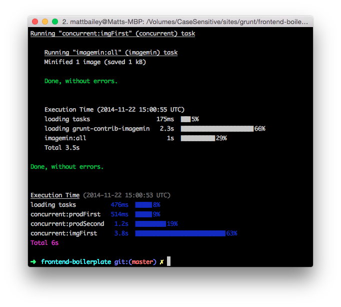

# Руководство для начинающих в Grunt: Redux


Ещё в марте 2013 я написал [A Beginner’s Guide To Grunt](http://mattbailey.io/a-beginners-guide-to-grunt/ "Matt Bailey: A Beginner's Guide To Grunt") и это стала наиболее посещаемая статья моего сайта. Я написал её во время, когда я только начинал знакомство с [Grunt](http://gruntjs.com/ "Grunt") и это было в большей мере руководство для меня, чем для кого-то другого. Теперь, спустя 18 месяцев, я чувствую, что пришла пора пересмотреть подходы к Grunt, потому что за это время я многому научился.

**Если вам не терпится получить сам код, то можете его взять [здесь на Github](https://github.com/matt-bailey/grunt-frontend-boilerplate).**

## Глобальная установка Node и Grunt

Во-первых вам нужно убедиться, что у вас установлен [Node](http://nodejs.org/download/) и [Grunt CLI](http://gruntjs.com/getting-started) (command line interface).

*   Сайт Node имеет разные пакеты для загрузки для различных систем. [Полную информацию можно найти здесь](http://nodejs.org/download/).
*   После установки Node просто запустите следующую команду в вашем терминале (я использую [iTerm2](http://iterm2.com/)) для установки **grunt-cli**:

```
npm install -g grunt-cli
```

## Установка Ruby и Sass

**Обновление:** Я недавно переключился с использования  `grunt-contrib-sass` к `grunt-sass` , который использует более быстрый, но экспериментальный [libsass](http://libsass.org/) C++ компилятор. И он не требует использование Ruby или Sass гема. Однако, если у вас возникают проблемы при компиляции с помощью `grunt-sass`, то вам возможно нужно использовать `grunt-contrib-sass`,  в этом случае вам понадобится установка Ruby и Sass гемов.

<del>Я использую Sass в качестве моего CSS препроцессора. Для использования Sass Grunt задания вам нужно установить Ruby ([полная инструкция по инсталяции здесь](https://www.ruby-lang.org/en/installation/)) и, после того, как вы сделаете это, [Sass](http://sass-lang.com/download.html) gem:</del>

```
gem install sass
```

## Создание директорий проекта

Наш проект требует пару директорий при установке. Вот их зеркальная структура:

```
grunt/
src/
src/images/
src/scripts/
src/styles/
```

## Создание Gruntfile

Во-первых, я больше не использую ‘скаффолд’ инструменты (такие как `grunt init` или [Yeoman](http://yeoman.io/)). Я устанавливаю всё самостоятельно, что значит у меня намного большее понимание, что происходит. Это на самом деле не так сложно, если вы сделаете это несколько раз.

В корне вашего проекта создайте файл с именем`Gruntfile.js`.

Добавьте в этот файл следующий код:

```
module.exports = function(grunt) {

    require('time-grunt')(grunt);

    require('load-grunt-config')(grunt, {
        jitGrunt: true
    });
};
```

Верите или нет, это всё, что с нужно сделать с нашим Gruntfile!

`time-grunt` сообщает вам как много времени занимает каждая задача и общее время билда, а `jitGrunt: true` сообщает `load-grunt-config` использовать быстрый [jit-grunt](https://github.com/shootaroo/jit-grunt) (Just In Time) загрузчик задач (это опционально, но скорость же важна?).

## Создание файла пакета

Давайте продолжим и создадим наш базовый `package.json` файл. Этот файл вскорости будет содержать зависимости нашего проекта. Добавьте следующее (очевидно нужно сменить ссылку с ‘my project’ на действительное имя вашего проекта):

```
{
  "name": "my-project",
  "version": "0.0.1",
  "description": "My project"
}
```

## Добавление зависимостей

Теперь у нас есть всё необходимое для того, чтобы добавлять некоторые модули. Запустите каждую строчку из кода приведенного ниже, одну за другой:

```
npm install grunt --save-dev
npm install time-grunt --save
npm install load-grunt-config --save-dev
npm install grunt-concurrent --save-dev
npm install grunt-contrib-clean --save-dev
npm install grunt-contrib-imagemin --save-dev
npm install grunt-sass --save-dev
npm install grunt-contrib-uglify --save-dev
npm install grunt-contrib-jshint --save-dev
npm install jshint-stylish --save
npm install grunt-contrib-watch --save-dev
```

Если вы заглянете в `package.json`, то увидите что-то наподобие:

```
{
  "name": "my-project",
  "version": "0.0.1",
  "description": "My Project",
  "devDependencies": {
    "grunt": "^0.4.5",
    "grunt-concurrent": "^1.0.0",
    "grunt-contrib-clean": "^0.6.0",
    "grunt-contrib-imagemin": "^0.8.1",
    "grunt-contrib-jshint": "^0.10.0",
    "grunt-contrib-uglify": "^0.6.0",
    "grunt-contrib-watch": "^0.6.1",
    "grunt-sass": "^0.16.1",
    "load-grunt-config": "^0.13.1"
  },
  "dependencies": {
    "jshint-stylish": "^1.0.0",
    "time-grunt": "^1.0.0"
  }
}
```

Вот заключение того, что мы только что установили:

1.  `grunt`: Сам исполнитель задач.
2.  `time-grunt`: Это не обязательно, но весьма полезное дополнение - оно сообщает вам сколько времени занимает каждая задача и общее время билда.
3.  `load-grunt-config`: Позволяет вам держать ваш основной Gruntfile в коротком и упорядоченом виде. Подробнее об этом чуть позже.
4.  `grunt-concurrent`: Запускает задачи одновременно - Grunt из-коробки будет запускать каждую задачу одну за другой, что может занянуться на время, в зависимости на количестве и типе заданий, необходимых для выполнения. Однако, часто есть задания, которые не зависят от других заданий, которые могут быть запущены в одно и то же время.
5.  `grunt-contrib-clean`: Очень просто, эта задача удаляет "вещи" - используйте с осторожностью!
6.  `grunt-contrib-imagemin`: Незаменимая вещь для всех оптимизационных нужд работы с изображениями.
7.  `grunt-sass`: Компиляция ваших SASS/SCSS файлов в CSS. **Обратите внимание:** Эта Sass задача использует более быстрый, но экспериментальный [libsass](http://libsass.org/) компилятор. Если у вас возникнут проблемы, то лучше используйте более стабильный, но медленный [grunt-contrib-sass](https://github.com/gruntjs/grunt-contrib-sass) компилятор задач.
8.  `grunt-contrib-uglify`: Делает ваш Javascript красивым и ужасным.
9.  `grunt-contrig-jshint`: Валидация ваших Javascript файлов.
10.  `jshint-stylish`: Полностью опционально, но это преобразовывает вывод `grunt-contrig-jshint` в отличный вид.
11.  `grunt-contrib-watch`: Запускает задачи при каких-либо изменениях наблюдаемых фалов.

## Конфигурация задач

Один из наилучших открытых мной модулей - это модуль `load-grunt-config`. Он позволяет нам устанавливать конфигурацию для каждого из наших заданий в отдельные файлы, что является более удобным в управлении, чем просто складывать всё в один длинный Gruntfile.

В `grunt` директории создайте следующие файлы:

```
grunt/aliases.yaml
grunt/concurrent.js
grunt/clean.js
grunt/imagemin.js
grunt/jshint.js
grunt/sass.js
grunt/uglify.js
grunt/watch.js
```

**Обратите внимание: Именя этих файлов должны соответствовать названиям задач.**

Скопируйте и вставьте конфигурации для каждой задачи ниже в соответствующий файл.

### aliases.yaml

```
default:
  description: 'Default (production) build'
  tasks:
    - prod
dev:
  description: 'Development build'
  tasks:
    - 'concurrent:devFirst'
    - 'concurrent:devSecond'
img:
  description: 'Image tasks'
  tasks:
    - 'concurrent:imgFirst'
devimg:
  description: 'Development build and image tasks'
  tasks:
    - dev
    - img
prod:
  description: 'Production build'
  tasks:
    - 'concurrent:prodFirst'
    - 'concurrent:prodSecond'
    - img
```
Здесь мы определяем различные псевдонимы для наших задач:

*   `default` - Запускает `prod`  задачи, когда вы запускаете `grunt` из командной строки.
*   `dev` - Запускает задачи разработки (но не задачи по изображениям)
*   `img` - Запускает задачи по изображениям
*   `devimg` - Запускает задачи по разработке и изображениям
*   `prod` - Запускает задачи производства и по изображениям

**[Перейдите сюда](https://github.com/firstandthird/load-grunt-config#aliases) за более подробной информацией  по конфигурированию псевдонимов задач для `load-grunt-config`.**

### concurrent.js

```
module.exports = {

    // Task options
    options: {
        limit: 3
    },

    // Dev tasks
    devFirst: [
        'clean',
        'jshint'
    ],
    devSecond: [
        'sass:dev',
        'uglify'
    ],

    // Production tasks
    prodFirst: [
        'clean',
        'jshint'
    ],
    prodSecond: [
        'sass:prod',
        'uglify'
    ],

    // Image tasks
    imgFirst: [
        'imagemin'
    ]
};
```
Взяв задачи по разработке как пример, вы можете видеть, что они установлены для запуска вначале  `clean` и далее `sass:dev` и `uglify` одновременно для регенерации css и javascript.

**[Перейдите сюда](https://github.com/sindresorhus/grunt-concurrent) за более подробной информацией  по конфигурированию `grunt-concurrent`.**

### clean.js

```
module.exports = {
    all: [
        "dist/"
    ]
};
```

Конфигурирование `grunt-contrib-clean` - это очень просто. Здесь я просто удаляю содержимое директори `dist/`. Используйте эту задачу с осторожностью - она будет удалять без разбора всё, что вы ей скажете без всяких оповещений, поэтому убедитесь, что сконфигурировали её правильно.

**[Перейдите сюда](https://github.com/gruntjs/grunt-contrib-clean) за более подробной информацией  по конфигурированию `grunt-contrib-clean`.**

### imagemin.js

```
module.exports = {
    all: {
        files: [{
            expand: true,
            cwd: 'src/',
            src: ['images/*.{png,jpg,gif}'],
            dest: 'dist/'
        }]
    }
};
```

Конфигурация выше, просто оптимизирует все изображения в `src/images/` и сохраняет их в `dist/images/`.

**[Перейдите сюда](https://github.com/gruntjs/grunt-contrib-imagemin) за более подробной информацией  по конфигурированию `grunt-contrib-imagemin`.**

### sass.js

```
module.exports = {
    // Development settings
    dev: {
        options: {
            outputStyle: 'nested',
            sourceMap: true
        },
        files: [{
            expand: true,
            cwd: 'src/styles',
            src: ['*.scss'],
            dest: 'dist/styles',
            ext: '.css'
        }]
    },
    // Production settings
    prod: {
        options: {
            outputStyle: 'compressed',
            sourceMap: false
        },
        files: [{
            expand: true,
            cwd: 'src/styles',
            src: ['*.scss'],
            dest: 'dist/styles',
            ext: '.css'
        }]
    }
};
```
Я разделил Sass задачу на рабочие процессы разработки и производства. Конфигурация очень схожа, но для целей разработки я установил стиль вывода в `nested` и активировал карты источников.

**[Перейдите сюда](https://github.com/sindresorhus/grunt-sass) за более подробной информацией по конфигурированию `grunt-sass`.**

### jshint.js

```
module.exports = {

    options: {
        reporter: require('jshint-stylish')
    },

    main: [
        'src/scripts/*.js'
    ]
};
```

Задача jshint валидирует ваш Javascript и гарантирует, что всё тип-топ.

**[Перейдите сюда](https://github.com/gruntjs/grunt-contrib-jshint) за более подробной информацией по конфигурированию `grunt-contrib-jshint`.**

### uglify.js

```
module.exports = {
    all: {
        files: [{
            expand: true,
            cwd: 'src/scripts',
            src: '**/*.js',
            dest: 'dist/scripts',
            ext: '.min.js'
        }]
    }
};
```

Задача uglify просто берёт Javascript файлы и минифицирует их - всё просто!

**[Перейдите сюда](https://github.com/gruntjs/grunt-contrib-uglify) за более подробной информацией по конфигурированию`grunt-contrib-uglify`.**

### watch.js

```
module.exports = {

    options: {
        spawn: false,
        livereload: true
    },

    scripts: {
        files: [
            'src/scripts/*.js'
        ],
        tasks: [
            'jshint',
            'uglify'
        ]
    },

    styles: {
        files: [
            'src/styles/*.scss'
        ],
        tasks: [
            'sass:dev'
        ]
    },
};
```

Watch запускает специфичные задач при изменении в наблюдаемых файлах - их добавлении, редактировании, удалении. 

**Обратите внимание: Наиболее простым способом заставить работать Livereload - это установить [расширение браузера](http://feedback.livereload.com/knowledgebase/articles/86242).**

**[Перейдите сюда](https://github.com/gruntjs/grunt-contrib-watch) за более подробной информацией по конфигурированию `grunt-contrib-watch` и Livereload.**

## Запуск задач

Если вы закончили установку вашего проекта, как приведено выше, тогда вы можете запустить задачи. Как обсуждалось рание, есть различные псевдонимы задач, которые вы можете запускать. Сейчас просто запустите `grunt` из командной строки из корня вашего проекта.

Если всё в порядке, то вы должны увидеть прокручивающийся по экрану текст и далее окончание сообщения, примерно такой.



Мне нравится этот небольшой вывод, который выдаёт `time-grunt`. Я могу увидеть как долго каждая одновремення зача выполняется, плюс как много времени занимает весь процесс - круто!

В зависимости от ваших требований, вы также можете выбрать для запуска команды `grunt dev`, `grunt devimg` или `grunt img`.

Вы также можете запустить `grunt watch`, если вам нужно наблюдать изменения в ваших `.scss` и `.js` файлах и автоматически запускать `sass` или `jshint` и `uglify` задачи.

## Выводы

Ну вот, пожалуй, и всё по этому вопросу. Если вы экспериментируете с вышеприведенным, то скоро вы набьёте руку, начнёте добавлять новые задачи и подстраивать под себя рабочий процесс. 

**Снова повторюсь, код в этой статье можно найти на [Github](https://github.com/matt-bailey/grunt-frontend-boilerplate).**

Оставляйте любые вопросы в комментариях ниже или делайте запросы на [github](https://github.com/matt-bailey/grunt-frontend-boilerplate/issues).
